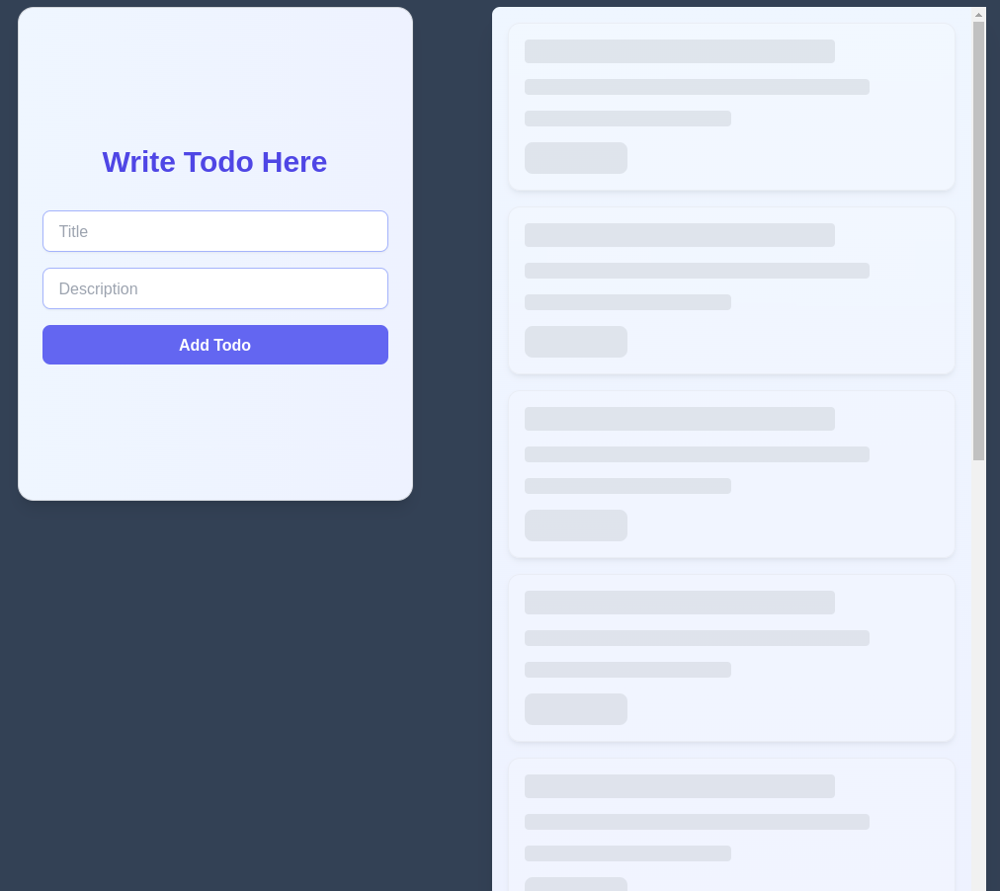
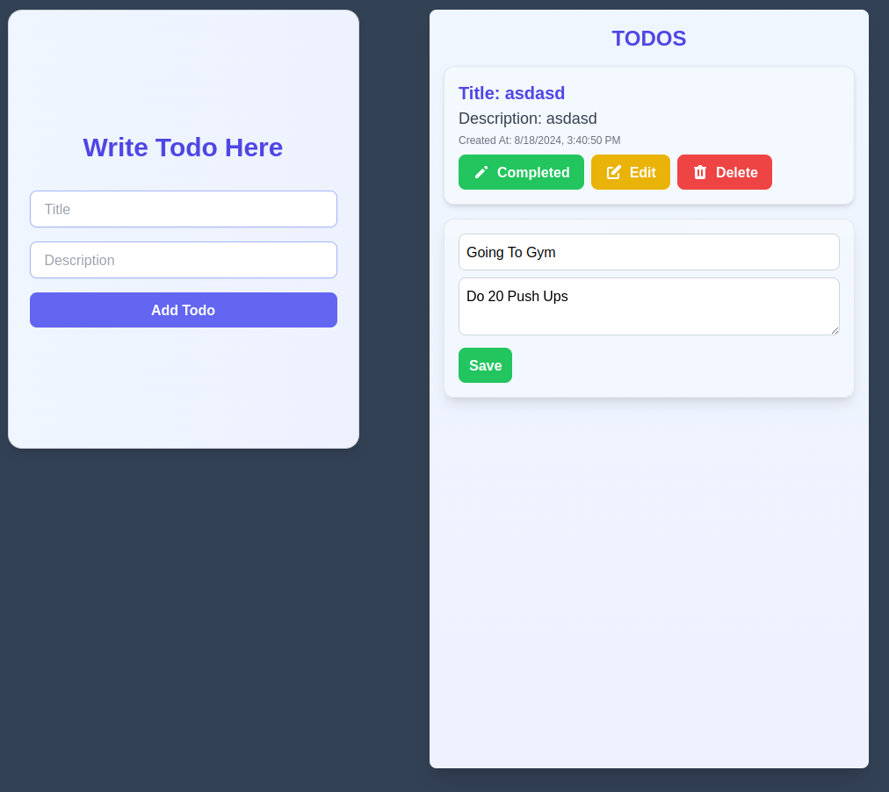

# MERN Todo App

This is a full-stack todo application built using the MERN (MongoDB, Express.js, React, Node.js) stack. The app allows users to add, edit, delete, and retrieve todos. All operations are performed directly on the database, ensuring data persistence.

## Features

- Add new todos
- Edit existing todos
- Delete todos
- Retrieve all todos from the database
- Permanent storage of todos in MongoDB

## Tech Stack

### Frontend
- React + Vite
- Axios for data fetching
- Props for data management

### Backend
- Node.js
- Express.js for routing
- MongoDB for data storage
- dotenv for environment variable management

## Setup and Installation

1. Clone the repository:
   ```
   git clone https://github.com/Vegadjay/Mern_Todo.git
   ```

2. Frontend setup:
   ```
   cd frontend
   npm install
   npm run dev
   ```

3. Backend setup:
   ```
   cd backend
   npm install
   ```

4. Create a `.env` file in the backend directory and add your MongoDB URL:
   ```
   MONGODB_URL=your_mongodb_connection_string
   ```

5. Start the backend server:
   ```
   node index.js
   ```

## API Endpoints

- GET all todos: `/todos`
- CREATE a new todo: `/todos`
- UPDATE a todo: `/todos/update/:title`
- DELETE a todo: `/todos/delete/:title`

## Database Structure

The app uses a simple MongoDB structure with a single collection named `todo` to store all todo items.

## Deployment

Future plans include deploying this project on Vercel.

## Screenshots

[Note: You mentioned adding 3 screenshots. Once you have these screenshots, you can add them to your project repository and include them in the README like this:]

1. 
2. 
3. 

## Contributing

This is the open source project and include many issue if you want to contribute in this repo simple fork this repo and start solving all the issues and open pull request and start your open source journey from here..


## License

MIT License

Copyright (c) 2024 Jay Vegad

Permission is hereby granted, free of charge, to any person obtaining a copy
of this software and associated documentation files (the "Software"), to deal
in the Software without restriction, including without limitation the rights
to use, copy, modify, merge, publish, distribute, sublicense, and/or sell
copies of the Software, and to permit persons to whom the Software is
furnished to do so, subject to the following conditions:

The above copyright notice and this permission notice shall be included in all
copies or substantial portions of the Software.

THE SOFTWARE IS PROVIDED "AS IS", WITHOUT WARRANTY OF ANY KIND, EXPRESS OR
IMPLIED, INCLUDING BUT NOT LIMITED TO THE WARRANTIES OF MERCHANTABILITY,
FITNESS FOR A PARTICULAR PURPOSE AND NONINFRINGEMENT. IN NO EVENT SHALL THE
AUTHORS OR COPYRIGHT HOLDERS BE LIABLE FOR ANY CLAIM, DAMAGES OR OTHER
LIABILITY, WHETHER IN AN ACTION OF CONTRACT, TORT OR OTHERWISE, ARISING FROM,
OUT OF OR IN CONNECTION WITH THE SOFTWARE OR THE USE OR OTHER DEALINGS IN THE
SOFTWARE.
